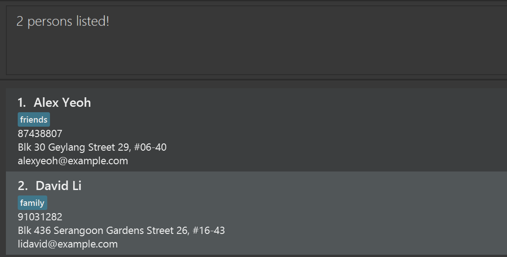

ManageHR is your all-in-one solution for seamless Human Resources management. Say goodbye to paperwork, spreadsheets, and administrative headaches. Our cutting-edge software empowers HR professionals to focus on what truly matters – your people.

Table of Contents
- Quick Start
- Features
- FAQ
- Known Issues
- Command summary

--------------------------------------------------------------------------------------------------------------------

## Quick start

1. Ensure you have Java `11` or above installed in your Computer.

1. Download the latest `<ManageHR.jar` from [here](https://github.com/se-edu/addressbook-level3/releases).

1. Copy the file to the folder you want to use as the _home folder_ for your AddressBook.

1. Open a command terminal, `cd` into the folder you put the jar file in, and use the `java -jar ManageHR.jar` command to run the application. 
   A GUI similar to the below should appear in a few seconds. Note how the app contains some sample data. 
   

1. Type the command in the command box and press Enter to execute it. e.g. typing **`help`** and pressing Enter will open the help window. 
   Some example commands you can try:

   * `list` : Lists all contacts.

   * `add n/John doe p/91234567 e/example@example.com a/1 Lower Kent Ridge Road d/SoC HR` : Quickly add a person:

   * `delete 3` : Deletes the 3rd contact shown in the current list.

   * `clear` : Deletes all contacts.

   * `exit` : Exits the app.

1. Refer to the [Features](#features) below for details of each command.

--------------------------------------------------------------------------------------------------------------------

## Features

**:information_source: Notes about the command format:** 

* Words in `UPPER_CASE` are the parameters to be supplied by the user. 
  e.g. in `add n/NAME`, `NAME` is a parameter which can be used as `add n/John Doe`.

* Items in square brackets are optional. 
  e.g `n/NAME [t/TAG]` can be used as `n/John Doe t/friend` or as `n/John Doe`.

* Items with `…`​ after them can be used multiple times including zero times. 
  e.g. `[t/TAG]…​` can be used as ` ` (i.e. 0 times), `t/friend`, `t/friend t/family` etc.

* Parameters can be in any order. 
  e.g. if the command specifies `n/NAME p/PHONE_NUMBER`, `p/PHONE_NUMBER n/NAME` is also acceptable.

* Extraneous parameters for commands that do not take in parameters (such as `help`, `list`, `exit` and `clear`) will be ignored. 
  e.g. if the command specifies `help 123`, it will be interpreted as `help`.

* If you are using a PDF version of this document, be careful when copying and pasting commands that span multiple lines as space characters surrounding line-breaks may be omitted when copied over to the application.

### Viewing help : `help`

Shows a message explaning how to access the user guide.

Format: `help`

Example:
- `help`

Acceptable values for each parameter:

| Paramters | Accepted input |
| --- | --- |
| nil | - |

Expected outputs:

| Outcome | Output |
| --- | --- |
| command success | Refer to the user guide: https://ay2324s1-cs2103-t16-1.github.io/tp/UserGuide.html |
| command fail | Command input error. Please check your command input. |

### Adding a person: `add`

Adds a person to ManageHR’s entries.

Format: `add n/NAME p/PHONE_NUMBER e/EMAIL a/ADDRESS d/DEPARTMENT`
- Adds an employee with the above fields
- All fields must be provided

Examples:
* `add n/Johnny p/91242712 e/johnnysins@gmail.com a/Johnny street, block 69, #05-05 d/ R&D`
* `add n/Elon p/12345678 e/elonma@gmail.com a/Elon street, block 140, #20-01 d/R&D`

Acceptable values for each parameter:

| Parameters | Accepted input |
| --- | --- |
| `NAME` | Alphabets |
| `PHONE_NUMBER` | 8 digits |
| `EMAIL` | Email with the pattern x@x.com where ‘x’ are alphanumerics |
| `ADDRESS` | Alphanumerics and ascii characters i.e. #, - |
| `DEPARTMENT` | Alphabets and ascii characters i.e. &, - |

Expected outputs:

| Outcome | Output |
| --- | --- |
| **Success** | Employee added! Johnny \| 12345678 \| johnnysins@gmail.com \| Johnny Street, block 69, #05-05 \| R&D |
| **Fail** | Please check the parameter inputs |

### Listing all employees : `list`

Description: Lists all employees currently stored

Format: `list`

Acceptable values for each parameter:

| Parameters | Accepted input |
| --- | --- |
| nil | - |

Succeed:

* Outcome: If the command is successful, it lists all employees and 
  displays a message "Listed all employees" along with a table of employee data as shown below.

Fail:
* Outcome: If the command format is incorrect, it displays a warning message "Unknown command."

### Editing a person : `edit`

Edits an existing person in the address book.

Format: `edit INDEX [n/NAME] [p/PHONE] [e/EMAIL] [a/ADDRESS] [d/DEPARTMENT]​`

* Edits the person at the specified `INDEX`. The index refers to the index number shown in the displayed person list.
* At least one of the optional fields must be provided.
* Existing values will be updated to the input values.

Examples:
*  `edit 1 p/91234567 e/johnsimmons@gmail.com` Edits the phone number and email address of the 1st person to be `91234567` and `johnsimmons@gmail.com` respectively.

### Locating persons by name: `find` `[Coming Soon]`

Finds persons whose names contain any of the given keywords.

Format: `find KEYWORD [MORE_KEYWORDS]`

* The search is case-insensitive. e.g `hans` will match `Hans`
* The order of the keywords does not matter. e.g. `Hans Bo` will match `Bo Hans`
* Only the name is searched.
* Only full words will be matched e.g. `Han` will not match `Hans`
* Persons matching at least one keyword will be returned (i.e. `OR` search).
  e.g. `Hans Bo` will return `Hans Gruber`, `Bo Yang`

Examples:
* `find John` returns `john` and `John Doe`
* `find alex david` returns `Alex Yeoh`, `David Li` 
  

### Deleting a person : `delete`

Deletes the specified person from the address book.

Format: `delete INDEX`

* Deletes the person at the specified `INDEX`.
* The index refers to the index number shown in the displayed person list.
* The index **must be a positive integer** 1, 2, 3, …​

Examples:
* `list` followed by `delete 2` deletes the 2nd person in the address book.
* `find Betsy` followed by `delete 1` deletes the 1st person in the results of the `find` command.

Succeed:
* You’ll see a reply "<Employee name> successfully deleted."

Fail:
* If the person to be deleted does not exist, a warning will be displayed.
“The person you’re trying to delete does not exist.”

  
### Exiting the program : `exit`

Exits the application.

Format: `exit`

### Saving the data

AddressBook data are saved in the hard disk automatically after any command that changes the data. There is no need to save manually.

### Editing the data file

AddressBook data are saved automatically as a JSON file `[JAR file location]/data/addressbook.json`. Advanced users are welcome to update data directly by editing that data file.

:exclamation: **Caution:**
If your changes to the data file makes its format invalid, AddressBook will discard all data and start with an empty data file at the next run. Hence, it is recommended to take a backup of the file before editing it.

### Archiving data files `[coming in v2.0]`

_Details coming soon ..._

--------------------------------------------------------------------------------------------------------------------

## FAQ

**Q:** How do I transfer my data to another Computer?

**A:** To transfer your data to another computer, follow these steps:

1. Install the app on the other computer if you haven't already.

2. Locate the empty data file that the app creates on the new computer.

3. Replace the empty data file with the file containing the data from your previous AddressBook home folder.

Now, your data should be successfully transferred to the new computer.

--------------------------------------------------------------------------------------------------------------------

## Known issues

1. **When using multiple screens**, if you move the application to a secondary screen, and later switch to using only the primary screen, the GUI will open off-screen. The remedy is to delete the `preferences.json` file created by the application before running the application again.

--------------------------------------------------------------------------------------------------------------------

## Command summary

Action | Format, Examples
--------|------------------
**Add** | `add n/NAME p/PHONE_NUMBER e/EMAIL a/ADDRESS d/DEPARTMENT`   e.g., `add n/Johnny p/91242712 e/johnnysins@gmail.com a/Johnny street, block 69, #05-05 d/ R&D`
**Exit** | `exit`
**Delete** | `delete INDEX`  e.g., `delete 4`
**Edit** | `edit INDEX [n/NAME] [p/PHONE] [e/EMAIL] [a/ADDRESS] [d/DEPARTMENT]`  e.g.,`edit 1 p/91234567 e/johnsimmons@gmail.com`
**List** | `list`
**Help** | `help`
